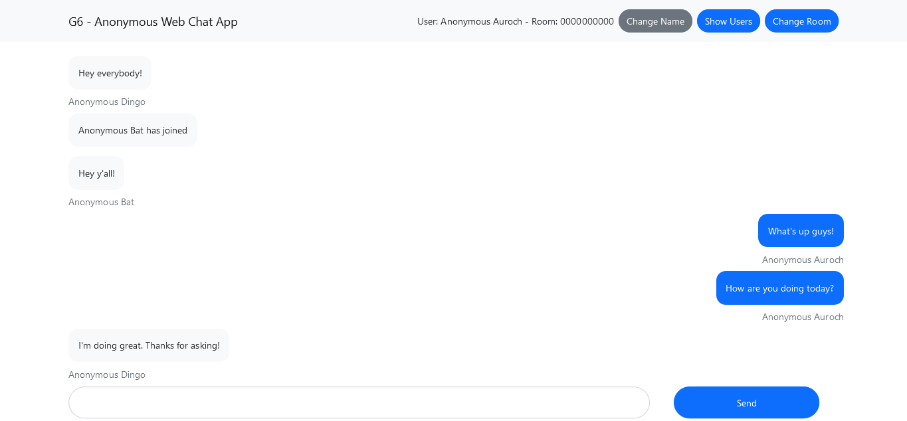
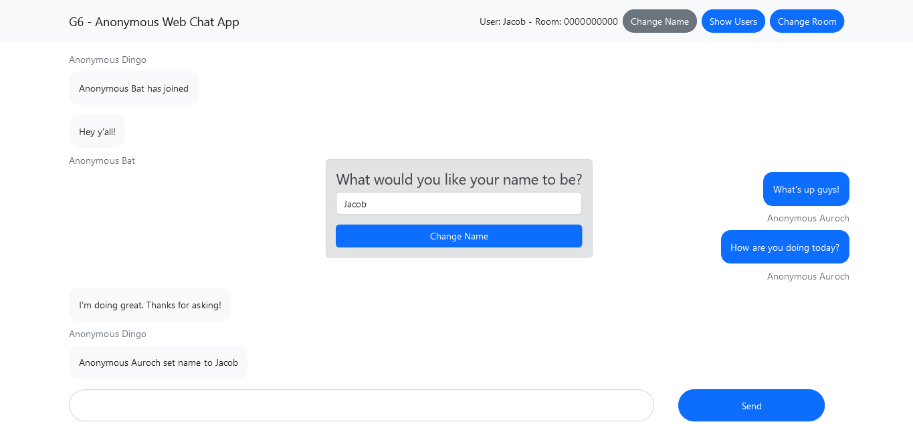
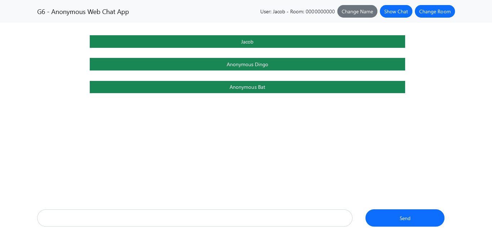
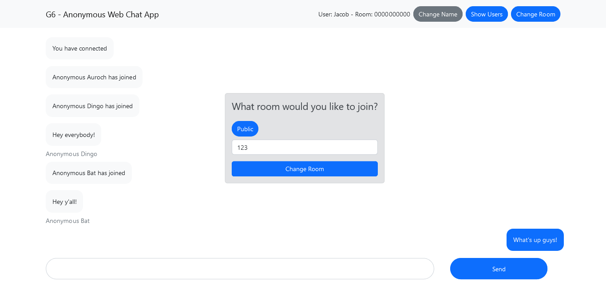
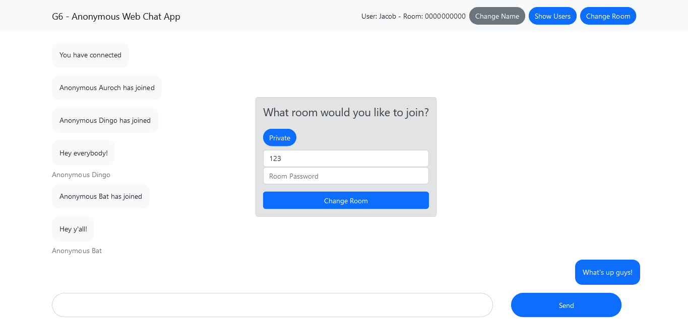
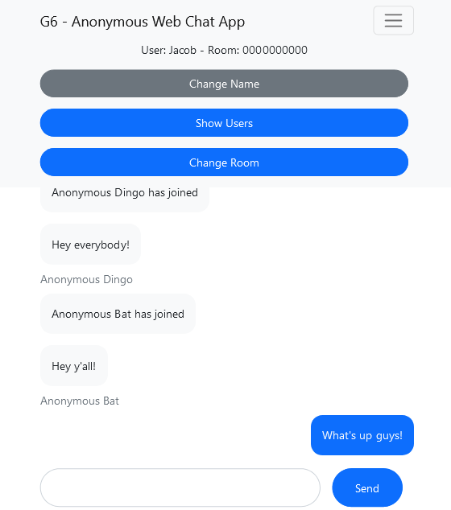

# G6 Web Chat Application
A web chat application for anonymous chatting in both public and private chatrooms. Built using Express, React, and Socket.IO. This was a group project for COMP SCI 5600 at Missouri S&T.

## Usage
### Client
Install the dependencies:
```
yarn add react-scripts
```

Start the application in development mode:
```
yarn start
```

### Server
Install the dependencies:
```
yarn add express cors nodemon socket.io
```

Start the server:
```
yarn start
```

## Demo
Opening the application leads new users to the global chat room. The global chat room is denoted by 
the chat room number #0000000000. All users are given anonymous names when they first enter a chat room, but have the ability to change their username. The users in the current chat room can be displayed at any time, all users in the chat room will receive a notification when a user leaves, enters, or changes their username. Users can switch to a chat room of their choice, or create a private chat room with a password.

### Users communicating in the global chat room:


### Change username:


### Show users in the current chat room:


### Change to a different public chat room:


### Change to a private chat room with a password:


### The application is responsive:
